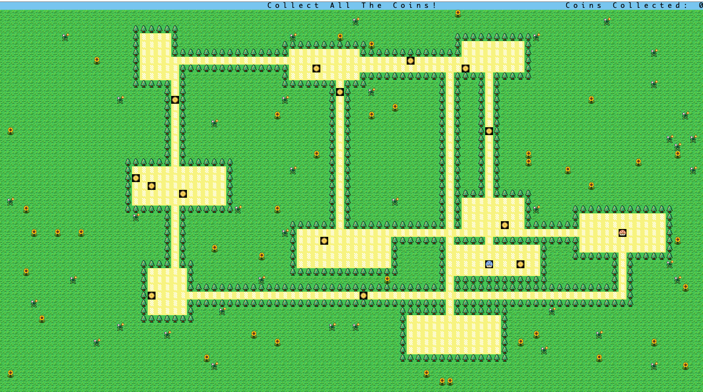

# BYOW

This is the project page for a randomly generating 2D tile-based game worlds. 

## World Description / How to Play

**Goal: collect all the coins in the generated world.**
The world is generated by a seed, which is an integer, each seed generates a different world.
Player(s): the little mushroom

### Game Options:

- Multiplayer Game (M): play with you friend! This is a collective effort! :)

- Toggle Mode (O): only if you are up for a challenge, it will restrict your field of view.

